# TetrisGYM

<div align="center">
    
    <br>
</div>
<br>

* [Getting Started](#getting-started)
* [Trainers](#trainers)
    * [Tetris](#tetris)
    * [T-Spins](#t-spins)
    * [Seed](#seed)
    * [Stacking](#stacking)
    * [Pace](#pace)
    * [Setups](#setups)
    * [B-Type](#b-type)
    * [Floor](#floor)
    * [(Quick)Tap](#quicktap)
    * [Tap Quantity](#tap-quantity)
    * [Checkerboard](#checkerboard)
    * [Transition](#transition)
    * [Garbage](#garbage)
    * [Drought](#drought)
    * [DAS Delay](#das-delay)
    * [Double Killscreen](#double-killscreen)
    * [Invisible](#invisible)
    * [Hard Drop](#hard-drop)
* [Level Menu](#level-menu)
* [Highscores](#highscores)
* [Tap/Roll Speed Tester](#taproll-speed-tester)
* [Scoring](#scoring)
* [Hz Display](#hz-display)
* [Input Display](#input-display)
* [Disable Flash](#disable-flash)
* [Disable Pause](#disable-pause)
* [Goofy Foot](#goofy-foot)
* [Block Tool](#block-tool)
    * [Level Editor](#level-editor)
    * [Savestates](#savestates)
* [Linecap](#linecap)
* [DAS Only](#das-only)
* [Qualifier Mode](#qual-mode)
* [PAL Mode](#pal-mode)
* [Development](#development)
* [Resources](#resources)

## Getting Started

TetrisGYM is a practise mod for NES Tetris.

While originally based on the NTSC version of the game, the patched ROM supports PAL and NTSC gameplay types.

TetrisGYM is distributed in the form of a BPS patch and can be applied to the USA version of the game with [Rom PatcherJS](https://www.romhacking.net/patch/) or similar.

```
File SHA-1: 77747840541BFC62A28A5957692A98C550BD6B2B
File CRC32: 6D72C53A
ROM SHA-1: FD9079CB5E8479EB06D93C2AE5175BFCE871746A
ROM CRC32: 1394F57E
```

A link to the BPS can be found on the [releases page](https://github.com/kirjavascript/TetrisGYM/releases).

There is also a `CNROM.bps` patch for mapper 3 support. (The original ROM uses MMC1/mapper 1)

## Trainers

Some trainers have additional configuration values; use left and right in the main menu to change them.

Like in the original ROM, holding `a` `b` `select` and then pressing `start` will end gameplay and return to the menu screens.

### Tetris

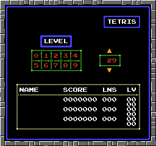

Same gameplay as A-Type, with some improvements: no score cap, no rocket, no curtain, no music, always next box, better pause, start on any level.

### T-Spins


Spawn T-Spins in random positions. Additional entry delay on successful T-Spin to prepare for the next state.

### Seed

Provides same piece sets for VS battles (or practise).

Press `select` to generate a random seed.

A small number of seeds are different between v4 and v5, but otherwise both versions are compatible.

An indicator will show which seeds are for v4 and which are for v5, and pressing `select` will always generate a v4 compatible seed.

### Stacking

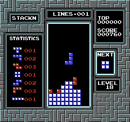

An experiment in highlighting areas of the playfield.

### Pace

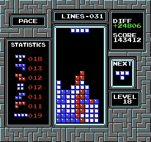

Indicates how close you are to achieving a score by 230 lines. Loosely based on Tetris rate.

You can choose scores up to and including 1.5m in increments of 100k.

This can be adjusted for transition or PAL games;

| value | score at 130 lines |
| ----- | ------------------ |
| 4 | 201261 |
| 5 | 252936 |
| 6 | 300278 |
| 7 | 353015 |
| 8 | 400356 |
| 9 | 452031 |
| A | 508690 |
| B | 552131 |
| C | 600535 |
| D | 655460 |
| E | 706051 |
| F | 752310 |

### Setups

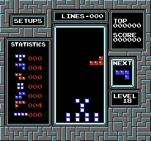

Several preset playfields for practising different types of tucks and spins.

0. Z
1. T / S
2. T
3. I
4. Buco
5. Various
6. L / J Spintuck
7. L / J Doubletuck

### B-Type

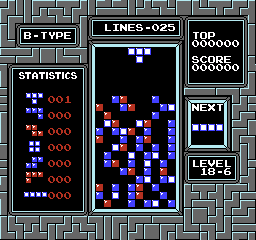

Same gameplay as B-Type in the original, except heights up to 8 are supported.

### Floor

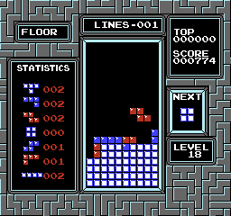

Fill in the floor to a certain height to force higher stacking. This mode is often referred to as 'handicap'.

Setting the height to zero will result in a game mode with burns disabled.

### (Quick)Tap

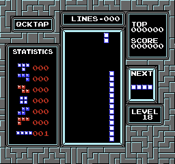

For practising tapping and quicktapping pieces over towers. 0-G will have a tower on the left of the screen and H-W will have a tower to the right.

### Tap Quantity

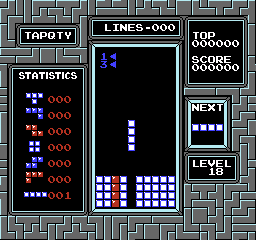

A trainer to drill different numbers of taps. Highlights the next well coming up.

The options 0-F clear lines when you fill the well, and G-V act like the piece locks without a line clear.

### Checkerboard

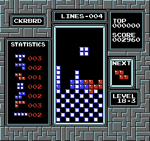

Similar to B-Type, except the garbage is a checkerboard.

Uses custom scoring.

### Transition

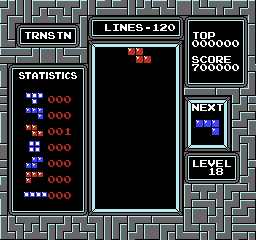

Puts you ten lines before transition. The value given will be added to your score, so set this to 5 and start on level 18 for a 'maxout trainer' style mode.

Setting the value to G causes the mode to act identical to the game genie code `SXTOKL`

### Garbage

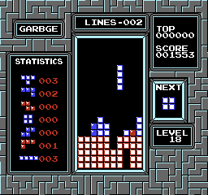

Different styles of garbage to dig through.

0. Always Tetris Ready - Pushes blocks to force tetris readiness
1. Normal Garbage - Random amounts of garbage
2. Smart Garbage - Follows your well
3. Hard Garbage - Brutal random garbage
4. Infinite Dig Generator - Scrambles the bottom of your stack

### Drought

Create artificially inflated droughts. Increasing the value causes less I pieces.

0 = normal gameplay I = no line pieces

### DAS Delay

Change the auto-shift delay rate.

### Double Killscreen

The pieces fall by two blocks every frame. It's hard.

The value multiplied by ten is the number of lines to transition from normal killscreen.

The value controls the transition from normal killscreen (a value of `x` transitions at `10*x` lines)

### Invisible

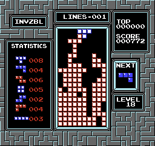

Blocks are invisible until the end of the game.

### Hard Drop

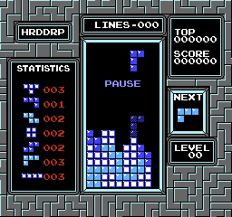

Press `up` to hard drop and `select` to soft drop.

## Level Menu

Retains the functionality of the original level menu, except;

Press `select` when choosing a level to show 'READY' text


Press `right` when on 9 to choose any level to start on with `up` and `down`.


Press `down` when on 5-9 to select hearts to display with `left` and `right`.


Used for keeping track of wins in local games.

## Highscores

Shows scores up to 8 digits, and includes lines and start level.

Name entry has better controls and some added characters.

If SRAM is available, scores will be saved and show again the next time the game boots.

To clear the highscores, select hearts and press `down`. Then confirm the prompts by pressing `start`.

## Tap/Roll Speed Tester

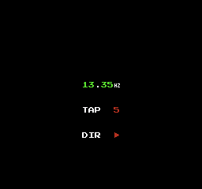

Practise tapping rate outside of gameplay.

## Scoring

The scoring modes only affect the display ingame, and your real score will be displayed in the high score list.

The scoring code is a complete reimplementation, and is not vulnerable to the game crash that the original causes.

In every mode except Classic, at 1000 lines an extra digit is added to the lines counter.

__Classic__


Behaves like the original uncapped scores, with digits A-F used for a rollover at 1.6 million.

After 100 million the score will jump by 800k, so you may want to use another mode if you plan on getting higher than that. (Your actual score will still display correctly in the high scores list.)

__Letters__

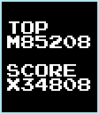

Show 0-9, then A-Z, then wrap.

__7 Digit__

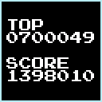

An extra scoring digit, rolls over at 10 million.

__M__

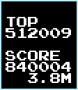

Shows your score in millions, rolls over at 100 million.

__Capped__

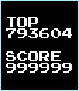

Cap your score at 999999.

## Hz Display


Shows the average tapping rate for each tap in a burst.

Also shows frames between spawn and first tap, and current tap direction.

## Input Display

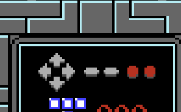

## Disable Flash

Disable the flashing from when you get a tetris.

## Disable Pause

Disable the ability to pause the game.

## Goofy Foot

Flips A/B, Start/Select, and inverts DPad directions like a Goofy Foot controller.

## Block Tool

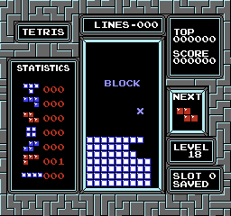

Allow more fine control over aspects of gameplay.

This is a config option only, and will enable the block tool globally.

When enabled, press start to use the editors.

### Level Editor

* DPad  
        Move around  
* Select + Left/Right  
        Switch between piece and playfield editors

In piece mode

* A / B  
        Change the current piece
* A + B  
        Change the next piece

In playfield mode

* A  
        Draw block at cursor
* B  
        Delete block at cursor

### Savestates

When paused

* Select + Up  
        Increment save slot
* Select + Down  
        Decrement save slot
* Select + A  
        Save state
* Select + B  
        Load state

During gameplay

* Select + B  
        Load state

Savestates allow you to save and reload playfields as many times as you want. These configurations are stored on your cart, and will persist after poweroff.

Savestates require SRAM to work. Tested and working on Everdrive / Emulator / MiSTerFPGA.

Combined with the level editor, savestates are effective for practising specific scenarios.

## Linecap

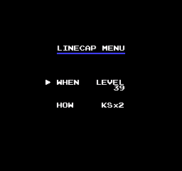

A game-ending linecap can be enabled at any level or linecount.

The linecap effects are;

* __KSx2__ - Pieces fall at two blocks every frame
* __Floor__ - A new unclearable row appears with each level change
* __Inviz__ - Pieces turn invisible
* __Halt__ - Pieces stop spawning

Used in the CTM Masters event.

## DAS Only

Remove the ability to use tapping or rolling to move the pieces.

All DAS behaviours work as normal, including quicktaps and slowtapping.

Created for CTWC DAS 2022

## Qual Mode

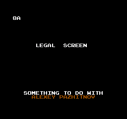

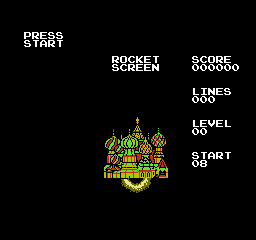

Reintroduces the 'wait screens', intended for use in qualifiers where the the player would otherwise gain a time advantage skipping the rocket, legal and title screens.

Also reintroduces other classic features like the end game curtain, standard pause, and no next box.

These features make TetrisGYM work better with post processing tools like [NestrisChamps](https://github.com/timotheeg/nestrischamps) and [MaxoutClub](https://maxoutclub.com/).

You can hold `select` when booting to start in Qual Mode.

You cannot use the Block Tool and Qual mode at the same time.

## PAL Mode

Dictate if the NTSC or PAL gameplay mechanics should be used. Should automatically detect region, but can be manually overwritten otherwise.

## Development

To build, you need a copy of `node` and `cc65` installed on your system.

Provide a `clean.nes` file of the unpatched ROM and run `sh build.sh` in a shell or `build.bat` on Windows.

CHR files are autogenerated from PNG on build, and nametables are generated via JS.

This project descends from the TAUS disassembly of NES Tetris and has been heavily modified. Large parts have been replaced, lots of optimisations, removal of unused code, non-game-mechanics related bugfixes, tooling, and different approaches to the disassembly work itself has taken place.


## Resources

* [https://github.com/ejona86/taus](https://github.com/ejona86/taus)  
* [https://github.com/CelestialAmber/TetrisNESDisasm](https://github.com/CelestialAmber/TetrisNESDisasm)  
